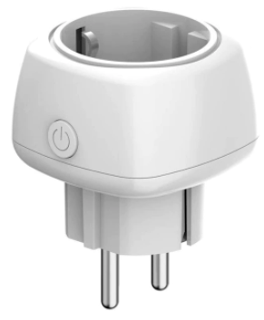

# ESP8266-HomeKit-Outlet

## Developed for TimeThinker hardware, but can be used on any ESP8266 based device

**I own TimeThinker Apple HomeKit  Outlet from AliExpress, but finctionality was unstable, a lot of rebooting and device was sending some (telemetry) data outside on LAN**

# Features
- Native integration to Apple Homekit
- WiFi Manager to simplify connection to WiFi network, using captive portal (192.168.4.1)
- Last state are saved to internal filesystem
- WEB Interface for status monitoring
- WEB based FW update possibility, accessible on `/update` URL

# Build and Flash
- All settings arew in `src/settings.h`
- Build in VS Code with PlatformIO extension
- Flash via USB-UART adapter/converter (PL-series, FT-series or similar). There is connection points on the outlet board for connect converter.

# Usage
- Short press - ON / OFF Toggle
- Long press - Reset HomeKit pairing and WiFi settings
- PowerUp with Button Pressed - Run WiFi Manager

# References
https://templates.blakadder.com/timethinker_TK04.html

https://www.aliexpress.com/wholesale?catId=0&initiative_id=SB_20220425115859&origin=y&SearchText=Timethinker+Smart+WiFi+Socket+for+Apple+Homekit&spm=a2g0o.detail.1000002.0
